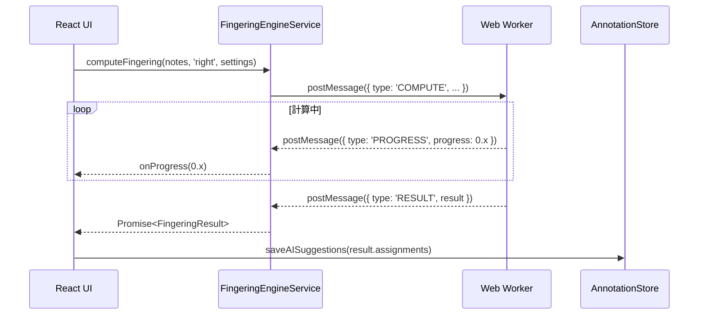

# Fingering Engine（運指提案エンジン）

## 概要

**目的**: 楽譜の音符列に対して最適な運指（指番号 1〜5）を計算して提案する

**責務**:
- Parncutt-Terzuoloモデルに基づく動的計画法（DP）で運指列を最適化する
- 右手・左手それぞれに独立して計算する
- Web Worker上で実行し、UIスレッドをブロックしない
- 手の大きさ設定をスパン制約に反映する

**実行場所**: Renderer Process の Web Worker (`fingering.worker.ts`)

---

## アルゴリズム設計（Parncutt-Terzuoloモデル）

### コスト関数

DPは隣接する2音符 (n₁, n₂) 間の遷移コスト `cost(f₁, f₂, n₁, n₂)` を最小化する。

```typescript
// コスト項目（各ルールに対応）
type CostRule =
  | 'SPAN'            // 指のスパンが快適範囲を超えた場合のペナルティ
  | 'POSITION_CHANGE' // 手のポジション移動コスト
  | 'WEAK_FINGER'     // 薬指・小指使用ペナルティ
  | 'THUMB_ON_BLACK'  // 黒鍵に親指を置くペナルティ
  | 'FIVE_ON_BLACK'   // 黒鍵に小指を置くペナルティ
  | 'THUMB_PASSING'   // 親指くぐり・指越えのコスト
  | 'CONSECUTIVE_WF'  // 4-5指の連続使用ペナルティ
  | 'LARGE_JUMP';     // 大きなポジションジャンプペナルティ
```

### スパン制約テーブル（右手基準）

| 指ペア | 白鍵快適スパン | 最大スパン |
|--------|-------------|-----------|
| 1-2 (親指-人差し指) | 長2度 (2) | 長6度 (9) |
| 1-3 (親指-中指) | 長3度 (4) | 長7度 (11) |
| 1-4 (親指-薬指) | 完全4度 (5) | 9度 (13) |
| 1-5 (親指-小指) | 完全5度 (7) | オクターブ+2 (14) |
| 2-3 | 長2度 (2) | 長3度 (4) |
| 2-4 | 短3度 (3) | 完全5度 (7) |
| 2-5 | 完全4度 (5) | 短7度 (10) |
| 3-4 | 長2度 (2) | 短3度 (3) |
| 3-5 | 短3度 (3) | 完全5度 (7) |
| 4-5 | 長2度 (2) | 長3度 (4) |

スパンの単位はセミトーン数。手の大きさ設定でスケールファクター（0.8〜1.2）を乗算する。

### DPアルゴリズム

```typescript
// 状態: (音符インデックス, 使用する指番号)
// 値: その状態に至る最小累積コスト

interface DPState {
  cost: number;
  prevFinger: Finger | null;
}

function computeFingering(notes: Note[], hand: Hand, settings: HandSettings): FingeringResult {
  const n = notes.length;
  // dp[i][f] = 音符iに指fを割り当てた時の最小コスト
  const dp: DPState[][] = Array(n).fill(null).map(() => Array(6).fill({ cost: Infinity, prevFinger: null }));

  // 初期化: 最初の音符
  for (const f of FINGERS) {
    dp[0][f] = { cost: initialCost(f, notes[0], hand), prevFinger: null };
  }

  // DP遷移
  for (let i = 1; i < n; i++) {
    for (const f2 of FINGERS) {
      for (const f1 of FINGERS) {
        const transitionCost = computeTransitionCost(f1, f2, notes[i-1], notes[i], hand, settings);
        const totalCost = dp[i-1][f1].cost + transitionCost;
        if (totalCost < dp[i][f2].cost) {
          dp[i][f2] = { cost: totalCost, prevFinger: f1 };
        }
      }
    }
  }

  // バックトラック: 最適経路を復元
  return backtrack(dp, notes);
}
```

---

## インターフェース

### Web Worker メッセージ形式

```typescript
// Main → Worker
interface FingeringRequest {
  type: 'COMPUTE';
  requestId: string;
  notes: Note[];
  hand: 'right' | 'left';
  settings: HandSettings;
}

// Worker → Main
interface FingeringResponse {
  type: 'RESULT' | 'PROGRESS' | 'ERROR';
  requestId: string;
  result?: FingeringResult;
  progress?: number;   // 0.0〜1.0
  error?: string;
}

interface FingeringResult {
  assignments: FingerAssignment[];
  totalCost: number;
}

interface FingerAssignment {
  noteId: string;
  finger: 1 | 2 | 3 | 4 | 5;
  cost: number;        // この音符に割り当てたコスト（デバッグ用）
}

interface HandSettings {
  maxSpanSemitones: number;  // デフォルト: 14（オクターブ+短3度）
  scaleFactorLeft: number;   // 左手スパン補正（デフォルト: 1.0）
}
```

### Renderer からの呼び出し

```typescript
// FingeringEngineService (Renderer側のラッパー)
class FingeringEngineService {
  private worker: Worker;

  async computeFingering(
    notes: Note[],
    hand: 'right' | 'left',
    settings: HandSettings,
    onProgress?: (progress: number) => void
  ): Promise<FingeringResult>;
}
```

> **注記（[phase-11/TASK-047](../../tasks/phase-11/TASK-047.md) @../../tasks/phase-11/TASK-047.md）**:
> 個別リクエストを取り消す `cancel(requestId)` は呼び出し箇所が存在しない死にコードだったため削除済み。
> 全リクエストの一括破棄は `dispose()`（Worker終了時に全pendingRequestsをrejectする）で行う。

---

## 依存関係

### 依存するコンポーネント
- なし（Web Workerは独立して動作）

### 依存されるコンポーネント
- [Practice Engine](practice-engine.md) @practice-engine.md: 運指計算のトリガー
- [Annotation Store](annotation-store.md) @annotation-store.md: 計算結果の保存

---

## データフロー



---

## 内部設計

### モジュール構成

```
src/workers/
└── fingering/
    ├── fingering.worker.ts      # Web Workerエントリポイント
    ├── dp-solver.ts             # DPアルゴリズム本体
    ├── cost-functions.ts        # 各コストルール実装
    ├── span-table.ts            # 指ペアのスパン制約テーブル
    ├── scale-patterns.ts        # スケール・アルペジオ定型パターン
    └── types.ts                 # 型定義
```

### スケール定型パターン

スケール・アルペジオは定型運指が確立されているため、DPより優先して適用する。

```typescript
const SCALE_PATTERNS: Record<string, { right: Finger[]; left: Finger[] }> = {
  'C_MAJOR': { right: [1,2,3,1,2,3,4,5], left: [5,4,3,2,1,3,2,1] },
  'G_MAJOR': { right: [1,2,3,1,2,3,4,5], left: [5,4,3,2,1,3,2,1] },
  // ... 全24調
};
```

---

## エラー処理

| エラー種別 | 発生条件 | 対処方法 |
|-----------|---------|---------|
| TimeoutError | 60秒以内に計算完了しない | Workerを再起動、部分結果を返す |
| InvalidNoteError | 音符データが不正（MIDIナンバー範囲外等） | その音符をスキップし計算を継続 |

---

## テスト観点

- [ ] 正常系: Cメジャースケール（右手）の運指が標準的なものと一致する
- [ ] 正常系: オクターブ跳躍で適切な親指使用が提案される
- [ ] 正常系: 手の大きさ設定を小さくするとスパンの大きい運指が回避される
- [ ] 異常系: 空の音符配列を渡した場合に空の結果を返す
- [ ] パフォーマンス: 100小節（約800音符）を30秒以内に計算完了する

---

## 関連要件

- [REQ-009-A01〜A06](../../requirements/stories/US-009.md) @../../requirements/stories/US-009.md: 運指アルゴリズム要件
- [NFR-P-005](../../requirements/nfr/performance.md) @../../requirements/nfr/performance.md: 計算時間 < 30秒
