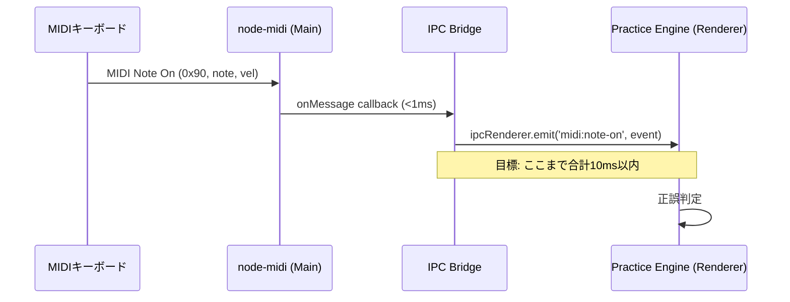

# MIDI Controller

## 概要

**目的**: MIDIデバイスの検出・接続管理と、ノートイベントのリアルタイム転送

**責務**:
- USBおよびネイティブMIDI接続デバイスを自動検出する
- ノートオン/オフイベントを10ms以内にRenderer Processへ転送する
- 複数デバイス接続時の選択・切替を管理する
- デバイス切断時に自動再接続を試みる

**実行場所**: Electron Main Process（低遅延のためネイティブ処理）

---

## インターフェース

### IPC チャンネル定義

```typescript
// Preload Script で公開するAPI
interface MidiAPI {
  // デバイス一覧取得
  getDevices(): Promise<MidiDevice[]>;
  // デバイス選択
  selectDevice(deviceId: string): Promise<void>;
  // イベント購読（Renderer → Main → Renderer のコールバック）
  onNoteOn(callback: (event: MidiNoteEvent) => void): UnsubscribeFn;
  onNoteOff(callback: (event: MidiNoteEvent) => void): UnsubscribeFn;
  onDeviceChange(callback: (devices: MidiDevice[]) => void): UnsubscribeFn;
}

interface MidiDevice {
  id: string;
  name: string;
  isConnected: boolean;
}

interface MidiNoteEvent {
  noteNumber: number;    // 0-127 (MIDIノートナンバー)
  velocity: number;      // 0-127
  timestamp: number;     // performance.now() 相当
  channel: number;       // MIDIチャンネル 1-16
}
```

### 内部実装（Main Process）

```typescript
// node-midi ラッパー
class MidiControllerService {
  private input: midi.Input;
  private selectedDeviceIndex: number;

  initialize(): void;
  listDevices(): MidiDevice[];
  selectDevice(index: number): void;
  onMessage(deltaTime: number, message: number[]): void; // node-midi コールバック
  private parseNoteEvent(message: number[]): MidiNoteEvent | null;
  dispose(): void;
}
```

---

## 依存関係

### 依存するライブラリ
- **node-midi**: Electronにバンドルされるネイティブアドオン。Electronの`rebuild`で再コンパイルが必要。

### 依存されるコンポーネント
- [Practice Engine](practice-engine.md) @practice-engine.md: ノートイベントの受信と正誤判定

---

## データフロー



---

## エラー処理

| エラー種別 | 発生条件 | 対処方法 |
|-----------|---------|---------|
| DeviceDisconnected | USB抜線等でデバイスが切断 | トースト通知 + 3秒間隔で5回再接続試行 |
| NoDeviceFound | 起動時にMIDIデバイスが存在しない | 警告表示のみ、キーボード/マウス入力で継続可能 |

---

## テスト観点

- [ ] 正常系: デバイス一覧が正しく取得できる
- [ ] 正常系: ノートオンイベントが10ms以内に転送される（ベンチマーク）
- [ ] 正常系: デバイス切断後の再接続が成功する
- [ ] 正常系: 複数デバイス接続時に選択したデバイスのみ有効になる
- [ ] 異常系: デバイスなしでもアプリが正常起動する

---

## 関連要件

- [REQ-004-001〜008](../../requirements/stories/US-004.md) @../../requirements/stories/US-004.md: MIDI入力と正誤判定
- [NFR-P-001](../../requirements/nfr/performance.md) @../../requirements/nfr/performance.md: MIDI遅延 < 10ms
