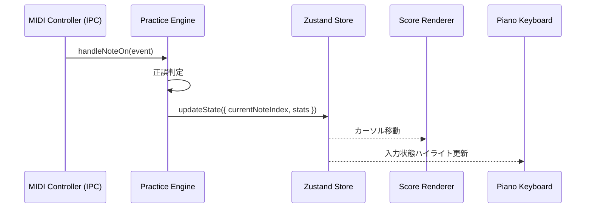

# Practice Engine（練習エンジン）

## 概要

**目的**: 練習セッション全体の状態管理と正誤判定ロジックの中枢

**責務**:
- 現在の練習位置（小節・音符インデックス）を管理する
- MIDI入力と楽譜の音符を照合して正誤を判定する
- 右手/左手/両手モードに応じた判定スコープを制御する
- A-Bループ範囲の管理と折り返しを実行する
- 練習結果（正解率・タイミング）を記録する

**実行場所**: Renderer Process（Zustand Storeと統合）

---

## 状態定義

```typescript
interface PracticeSessionState {
  // 楽譜
  score: Score | null;

  // 練習モード
  practiceMode: 'right' | 'left' | 'both';
  errorMode: 'wait' | 'pass';   // 誤りで待機 or 自動通過

  // 現在位置
  currentMeasure: number;
  currentNoteIndex: number;      // 現在期待している音符のインデックス
  expectedNotes: Note[];         // 現在押すべき音符群（コード対応）

  // ループ
  loopEnabled: boolean;
  loopStart: number;             // 開始小節番号
  loopEnd: number;               // 終了小節番号
  loopCount: number;             // 現在のループ回数

  // テンポ
  bpm: number;
  originalBpm: number;
  metronomeEnabled: boolean;

  // セッション統計
  stats: PracticeStats;
}

interface PracticeStats {
  totalNotes: number;
  correctNotes: number;
  incorrectAttempts: number;
  startedAt: Date;
}
```

---

## インターフェース

### 主要メソッド

#### `handleNoteOn(event: MidiNoteEvent): NoteJudgement`

MIDI ノートオンを受け取り、正誤を判定して次の状態に進める。

**パラメータ**:
| 名前 | 型 | 説明 |
|------|-----|------|
| event | MidiNoteEvent | MIDIコントローラーからのイベント |

**戻り値**: `NoteJudgement`
```typescript
interface NoteJudgement {
  result: 'correct' | 'incorrect' | 'ignored';
  note: Note | null;
  advanced: boolean;    // 次の音符に進んだかどうか
}
```

**正誤判定ロジック**:
1. `practiceMode` に基づき対象パートを決定
2. `expectedNotes` と `event.noteNumber` を照合
3. コード（和音）は全音符が揃った時点で `correct` 判定
4. 不正解かつ `errorMode === 'wait'` の場合は位置を進めない

#### `setLoop(start: number, end: number): void`

#### `advancePosition(): void`

#### `resetToMeasure(measureNumber: number): void`

---

## データフロー



---

## エラー処理

| エラー種別 | 発生条件 | 対処方法 |
|-----------|---------|---------|
| ScoreNotLoaded | スコアなしで練習開始 | 操作を無視してファイル読込を促すメッセージ |
| InvalidLoopRange | start >= end | UIでバリデーションして防止 |

---

## テスト観点

- [ ] 正常系: 正しい音符を押すと次の音符に進む
- [ ] 正常系: 誤った音符を押すと待機モードで位置が進まない
- [ ] 正常系: ループ範囲終端でループ先頭に戻る
- [ ] 正常系: 右手モードで左手パートの音符は判定をスキップする
- [ ] 正常系: コード（和音）は全音符が揃った時点で正解になる

---

## 関連要件

- [US-003](../../requirements/stories/US-003.md) @../../requirements/stories/US-003.md: 右手/左手分離練習
- [US-004](../../requirements/stories/US-004.md) @../../requirements/stories/US-004.md: MIDI入力と正誤判定
- [US-007](../../requirements/stories/US-007.md) @../../requirements/stories/US-007.md: 繰り返し練習
