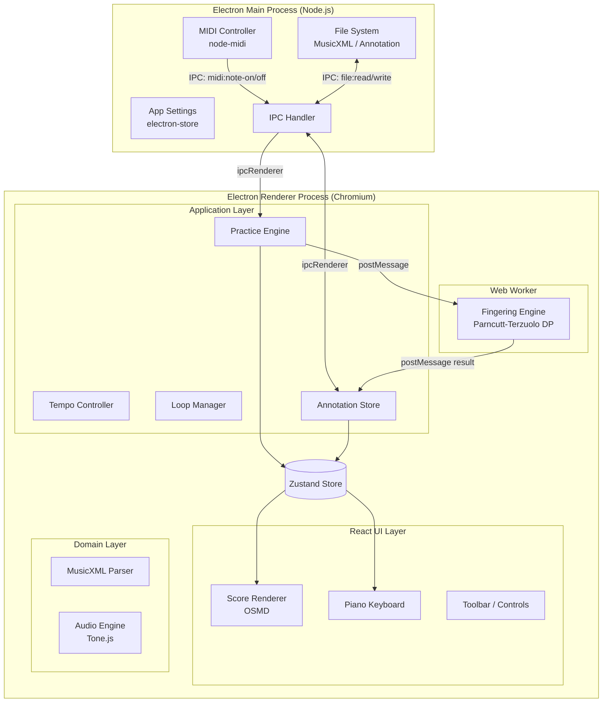

# 技術設計書 — MusicXMLピアノ練習アプリ

## 情報の明確性チェック

### ユーザーから明示された情報
- [x] 技術スタック: Electron + React/TypeScript（全機能TypeScriptで実装）
- [x] 外部ランタイム不要: Node.js・Pythonのインストール不要、自己完結パッケージ
- [x] 運指エンジン: Python/music21依存なし、TypeScriptで独自実装
- [x] 対象OS: Windows 10/11（Phase 1）、macOS 12+（Phase 2）
- [x] 楽譜レンダリング: OpenSheetMusicDisplay (OSMD)
- [x] パフォーマンス: MIDI遅延 < 10ms

### 不明/要確認の情報

| 項目 | 現状の理解 | 確認状況 |
|------|-----------|----------|
| 練習履歴の保存 | JSONファイルで保存 | [x] 設計判断として決定 |
| MIDIライブラリ | node-midi（メインプロセス）を採用 | [x] 設計判断として決定 |
| 状態管理 | Zustand を採用 | [x] 設計判断として決定 |

---

## アーキテクチャ概要

Electronの2プロセスモデル（Main / Renderer）を採用する。
MIDI入力はMain Processでネイティブ処理（低遅延）し、IPCでRendererに転送する。
運指計算はRenderer内のWeb Workerで非同期実行してUIをブロックしない。



---

## コンポーネント一覧

| コンポーネント | 実行場所 | 目的 | 詳細リンク |
|--------------|---------|------|-----------|
| MusicXML Parser | Renderer | MusicXMLをScoreデータモデルに変換 | [詳細](components/musicxml-parser.md) @components/musicxml-parser.md |
| Score Renderer | Renderer (UI) | OSMD経由で五線譜を描画・カーソル制御 | [詳細](components/score-renderer.md) @components/score-renderer.md |
| MIDI Controller | Main Process | MIDIデバイス検出・低遅延イベント転送 | [詳細](components/midi-controller.md) @components/midi-controller.md |
| Practice Engine | Renderer | 練習セッション管理・正誤判定 | [詳細](components/practice-engine.md) @components/practice-engine.md |
| Fingering Engine | Web Worker | Parncutt-TerzuoloモデルDP運指計算 | [詳細](components/fingering-engine.md) @components/fingering-engine.md |
| Piano Keyboard | Renderer (UI) | 88鍵盤の視覚的ガイド表示 | [詳細](components/piano-keyboard.md) @components/piano-keyboard.md |
| Audio Engine | Renderer | Tone.jsによる伴奏・メトロノーム再生 | [詳細](components/audio-engine.md) @components/audio-engine.md |
| Annotation Store | Renderer + Main | 運指・コメントのJSON永続化 | [詳細](components/annotation-store.md) @components/annotation-store.md |
| Toolbar | Renderer (UI) | ファイルを開く・再生・練習対象・テンポ・ループ・運指提案・統計表示の操作群 | [詳細](components/toolbar.md) @components/toolbar.md |

---

## データモデル

> **改訂（2026-07-04）**: 両手同時判定・曲再生（US-010）対応のため、時刻ベースモデル（v2）へ移行する。
> v2の型定義・tick算出規則・判定グループ仕様は [data-model-v2.md](components/data-model-v2.md) を正とする（決定: [DEC-005](decisions/DEC-005.md)）。
> 以下はv1（時刻なし）の構造であり、TASK-031/032完了後にv2へ置き換わる。

### 中心データ構造（v1）

```typescript
// 楽譜全体
interface Score {
  title: string;
  parts: Part[];           // 通常2パート（右手・左手）
  measures: Measure[];
  tempo: number;           // デフォルトBPM
  timeSignature: { beats: number; beatType: number };
  keySignature: number;    // -7〜7（フラット/シャープ数）
}

// パート（右手 or 左手）
interface Part {
  id: string;
  name: string;
  hand: 'right' | 'left' | 'unknown';
  clef: 'treble' | 'bass';
}

// 小節
interface Measure {
  number: number;
  notes: Note[];
}

// 音符
interface Note {
  id: string;
  partId: string;
  measureNumber: number;
  noteIndex: number;
  pitch: { step: string; octave: number; alter?: number };  // C, D, E...
  midiNumber: number;      // 0-127
  duration: number;        // 四分音符=1.0
  isChord: boolean;        // 和音の一部かどうか
  isRest: boolean;
}

// アノテーション
interface Annotation {
  noteId: string;          // Note.id と対応
  fingerNumber?: 1 | 2 | 3 | 4 | 5;
  comment?: string;
  isAISuggested: boolean;  // 運指提案エンジン出力か手動入力か
  isApproved: boolean;
}
```

### データ永続化

| データ | 形式 | 場所 |
|--------|------|------|
| アノテーション | JSON（サイドカーファイル） | MusicXMLと同フォルダ (`*.annotation.json`) |
| アプリ設定 | electron-store (JSON) | OS標準のアプリデータフォルダ |
| 練習履歴 | JSON Lines | アプリデータフォルダ (`history.jsonl`) |
| 最近のファイル | electron-store | アプリ設定内 |

詳細: [schema.md](database/schema.md) @database/schema.md

---

## 技術的決定事項

| ID | 決定内容 | ステータス | 詳細リンク |
|----|---------|-----------|-----------|
| DEC-001 | Electronを採用（TauriやFlutter不採用） | 承認済 | [詳細](decisions/DEC-001.md) @decisions/DEC-001.md |
| DEC-002 | MusicXML描画にOSMDを採用 | 承認済 | [詳細](decisions/DEC-002.md) @decisions/DEC-002.md |
| DEC-003 | 運指エンジンをTypeScriptで独自実装（Python不採用） | 承認済 | [詳細](decisions/DEC-003.md) @decisions/DEC-003.md |
| DEC-004 | MIDI入力をMain Processのnode-midiで処理 | 承認済（実装変更あり: Web MIDI APIに変更済み、PR #16） | [詳細](decisions/DEC-004.md) @decisions/DEC-004.md |
| DEC-005 | 時刻ベースデータモデル（PPQ480絶対tick）とnoteIdパート毎連番の採用 | 承認済 | [詳細](decisions/DEC-005.md) @decisions/DEC-005.md |

---

## セキュリティ考慮事項

- Electronの `contextIsolation: true` + `nodeIntegration: false` を必須とする
- Main↔Renderer間通信はすべてPreload Script経由の型付きIPCのみ許可
- ユーザーのMusicXMLファイルパスはサンドボックス外へ公開しない
- 外部ネットワーク接続は自動アップデート確認のみ（Electron Updater）

## パフォーマンス考慮事項

- MIDIイベント処理: Main ProcessでNode.jsネイティブ処理（node-midi）、IPC転送でも合計10ms以内を目標
- 運指計算: Web Workerで実行し、計算中もUIは60fps維持
- 楽譜レンダリング: OSMDの`drawingParameters`でオフスクリーン描画を活用

## エラー処理戦略

- MusicXMLパースエラー: ユーザーにエラーダイアログ表示、前の状態を維持
- MIDIデバイス切断: トースト通知 + 自動再接続試行（3秒間隔×5回）
- 運指計算タイムアウト: 60秒でWebWorkerを強制終了、部分結果を返す

## CI/CD設計

### 品質ゲート

| 項目 | 基準値 | 採用ツール |
|------|--------|-----------|
| テストカバレッジ | 80%以上 | Vitest |
| Linter | エラー0件 | ESLint + Prettier |
| 型チェック | エラー0件 | TypeScript strict mode |
| コード複雑性 | 循環的複雑度10以下 | complexity-report |

### ビルド・配布パイプライン

```
push → lint + typecheck → unit test → electron-builder
     → Windows: NSIS installer (.exe)
     → macOS: dmg / zip（arm64 + x64）  [対応済み。TASK-035で追加]
```

---

## ドキュメント構成

```
docs/sdd/design/
├── index.md                       # このファイル
├── components/
│   ├── musicxml-parser.md         # MusicXML解析
│   ├── score-renderer.md          # 楽譜表示（OSMD）
│   ├── midi-controller.md         # MIDI入出力
│   ├── practice-engine.md         # 練習セッション管理
│   ├── fingering-engine.md        # 運指提案エンジン（DP）
│   ├── piano-keyboard.md          # 88鍵盤UI
│   ├── audio-engine.md            # 音声再生（Tone.js）
│   ├── annotation-store.md        # アノテーション永続化
│   ├── toolbar.md                 # ツールバー・練習コントロール群
│   └── data-model-v2.md           # 時刻ベースデータモデル（v2）
├── database/
│   └── schema.md                  # データスキーマ
└── decisions/
    ├── DEC-001.md                  # Electron採用
    ├── DEC-002.md                  # OSMD採用
    ├── DEC-003.md                  # TypeScript運指エンジン
    ├── DEC-004.md                  # node-midi採用
    └── DEC-005.md                  # 時刻ベースデータモデル・noteId統一
```
